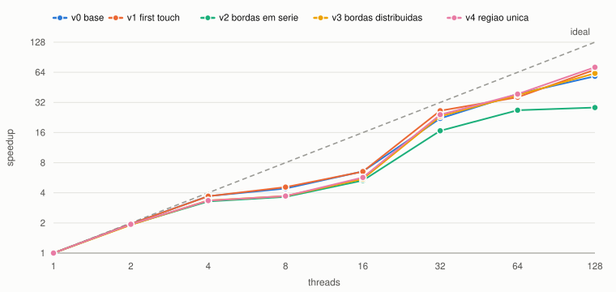
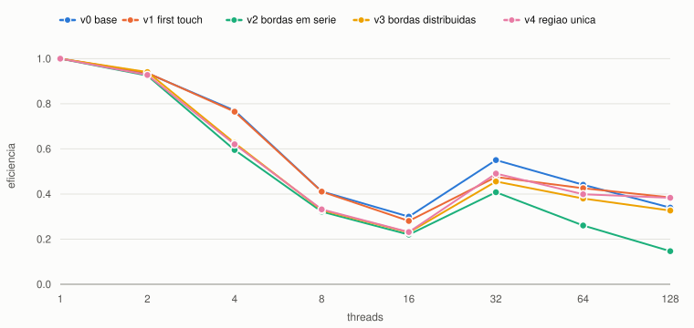
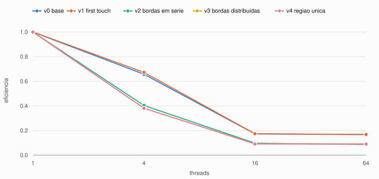

# Escalabilidade do código de Navier-Stokes no NPAD

## O que foi medido

O ponto de partida é o código da Tarefa 11: difusão viscosa em malha `n × n`,
diferenças centrais, Euler explícito, bordas periódicas. Lá o objetivo era
comparar cláusulas e nada foi otimizado. Aqui o objetivo é o oposto — encontrar
os gargalos e removê-los em versões sucessivas.

As três definições usadas:

| termo | definição |
|---|---|
| escalável | dá para manter a eficiência se o problema crescer junto com o número de threads |
| **fortemente** escalável | mantém a eficiência aumentando as threads **sem** aumentar o problema |
| **fracamente** escalável | mantém a eficiência se o problema crescer na **mesma taxa** das threads |

Fortemente escalável implica escalável, e fracamente escalável também. Nenhuma
das duas implica a outra.

Na escalabilidade forte, `n = 2048` fixo e as threads vão de 1 a 128;
eficiência = speedup / p. Na fraca, o trabalho por thread fica constante em
1024 × 1024 células: p = 1, 4, 16, 64 com n = 1024, 2048, 4096, 8192;
eficiência = T(1) / T(p).

**Máquina.** NPAD, partição `amd-512`, nó `r2n19` com `--exclusive`: dois AMD
EPYC 7713, 64 núcleos cada, **8 domínios NUMA** de 16 núcleos e **32 MB de L3 por
CCX de 8 núcleos** — 512 MB de L3 somando os 16 CCX. gcc 8.5.0 com
`-O2 -Wall -Wextra -std=c11 -fopenmp`, `OMP_PLACES=cores`, `OMP_PROC_BIND=close`,
`clock_gettime(CLOCK_MONOTONIC)`, mediana de 5 execuções, 200 passos.

Essa topologia é o que explica quase tudo o que vem a seguir, então vale fixar um
número: com `n = 2048`, as quatro matrizes ocupam **128 MB**.

## As cinco versões

| | mudança | gargalo atacado |
|---|---|---|
| `v0` | código da Tarefa 11 | — (referência) |
| `v1` | inicialização paralela, com o mesmo `schedule(static)` do cálculo | *first touch*: as páginas passam a ficar no nó NUMA da thread que as usa |
| `v2` | interior sem `%`, bordas tratadas à parte, em série | 4 divisões inteiras por célula |
| `v3` | cada thread fecha as bordas laterais das próprias linhas | trecho serial criado pela `v2` |
| `v4` | uma única região paralela em volta do laço de tempo | 200 fork-joins |

Na `v4` os quatro ponteiros entram como `firstprivate`, então cada thread troca a
sua própria cópia ao fim do passo. A barreira implícita do `omp for` já garante
que ninguém comece o passo seguinte antes de todos terminarem, e por isso não é
preciso `single` nem barreira explícita para a troca.

Todas as versões foram comparadas byte a byte com a `v0` sequencial, em 1, 8 e 64
threads. As quinze combinações deram campo final idêntico.

## Escalabilidade forte

Speedup com <code>n = 2048</code> fixo. Escala log-log: a reta tracejada é o speedup ideal.

Eficiência = speedup / p, mesmo experimento. A queda até 16 threads e a recuperação em 32 aparecem nas cinco versões.

Tempos em segundos:

| threads | v0 | v1 | v2 | v3 | v4 |
|---:|---:|---:|---:|---:|---:|
| 1 | 4,4549 | 4,4659 | 3,5188 | 3,5310 | 3,5507 |
| 2 | 2,2740 | 2,2791 | 1,8241 | 1,8487 | 1,8316 |
| 4 | 1,2025 | 1,2072 | 1,0727 | 1,0519 | 1,0610 |
| 8 | 1,0085 | 0,9789 | 0,9655 | 0,9502 | 0,9555 |
| 16 | 0,6798 | 0,6841 | 0,6628 | 0,6420 | 0,6233 |
| 32 | 0,2010 | 0,1690 | 0,2110 | 0,1519 | 0,1472 |
| 64 | 0,1147 | 0,1239 | 0,1317 | 0,0932 | 0,0915 |
| 128 | 0,0763 | 0,0656 | 0,1236 | 0,0564 | **0,0494** |

Eficiência:

| threads | v0 | v1 | v2 | v3 | v4 |
|---:|---:|---:|---:|---:|---:|
| 2 | 0,98 | 0,98 | 0,96 | 0,96 | 0,97 |
| 8 | 0,55 | 0,57 | 0,46 | 0,46 | 0,46 |
| 16 | 0,41 | 0,41 | 0,33 | 0,34 | 0,36 |
| 32 | 0,69 | 0,83 | 0,52 | 0,73 | 0,75 |
| 128 | 0,46 | 0,53 | 0,22 | 0,49 | 0,56 |

**A curva não é monótona, e isso não é ruído.** A eficiência cai até 16 threads,
sobe em 32 e volta a cair. As cinco versões fazem o mesmo desenho, o que descarta
acaso. A explicação está na topologia: com ligação `close`, as threads ocupam
CCX consecutivos, e o L3 agregado cresce com elas.

| threads | CCX ocupados | L3 agregado | conjunto de trabalho |
|---:|---:|---:|---:|
| 8 | 1 | 32 MB | 128 MB |
| 16 | 2 | 64 MB | 128 MB |
| **32** | **4** | **128 MB** | **128 MB** |
| 128 | 16 | 512 MB | 128 MB |

Em 32 threads o L3 agregado alcança o tamanho do problema, os dados passam a
sobreviver de um passo para o outro e o tráfego para a memória despenca. É um
ganho superlinear: dobrando as threads de 16 para 32, o tempo cai 3,4× na `v0` e
4,2× na `v4`. Conferindo pela banda: em 8 threads são 25,6 GB em 1,01 s, ou ~25 GB/s,
valor de DRAM de um nó NUMA só; em 128 threads, os mesmos 25,6 GB em 0,0494 s dão
~518 GB/s, acima de qualquer DRAM e compatível com dados servidos pelo L3.

**A `v2` piorou o programa paralelo, e esse é o resultado mais útil.** Tirar o `%`
deixou a versão sequencial 1,27× mais rápida (4,455 s → 3,519 s), o que era o
esperado. Mas em 128 threads a `v2` ficou 1,6× **mais lenta** que a `v0`. O motivo
é que eu deixei `bordas()` em série: ela percorre as colunas 0 e n−1 de 2046
linhas, ou seja, 4092 acessos dispersos, um por linha de cache, executados por uma
thread só. Pela lei de Amdahl, um speedup preso em 28,5× com 128 threads
corresponde a uma fração serial de cerca de 2,8%. Distribuir essas bordas
(`v3`) devolveu 2,19× em 128 threads.

Ganhos em 128 threads: a `v1` é 14% mais rápida que a `v0` — o *first touch* só
rende quando há mais de um nó NUMA envolvido, o que explica por que ele não
aparece abaixo de 32 threads; a `v3` é 2,19× mais rápida que a `v2`; e a `v4`
ganha mais 1,14× sobre a `v3` ao eliminar os 200 fork-joins. Do sequencial da
`v0` até a `v4` em 128 threads, 4,455 s → 0,0494 s: **90×**.

**Veredito: o código não é fortemente escalável.** A eficiência sai de 1,00 e
termina em 0,56 com 128 threads na melhor versão. Mantê-la constante com o
problema fixo não acontece em nenhuma delas.

## Escalabilidade fraca

Trabalho por thread constante em 1024 × 1024 células. Eficiência = T(1)/T(p).

| p | n | v0 | v1 | v2 | v3 | v4 |
|---:|---:|---:|---:|---:|---:|---:|
| 1 | 1024 | 1,00 | 1,00 | 1,00 | 1,00 | 1,00 |
| 4 | 2048 | 0,71 | 0,73 | 0,45 | 0,45 | 0,46 |
| 16 | 4096 | 0,21 | 0,21 | 0,11 | 0,11 | 0,11 |
| 64 | 8192 | 0,20 | 0,20 | 0,11 | 0,11 | 0,11 |

Tempos no maior ponto (p = 64, n = 8192): 4,109 s na `v0`, 4,119 s na `v1`,
4,245 s na `v2`, 4,108 s na `v3` e 4,097 s na `v4`. **As versões convergem.** Com
2 GB de matrizes contra 512 MB de L3, nada mais cabe em cache, o programa passa a
depender só da banda de memória, e nenhuma das otimizações toca nesse limite:
410 GB de tráfego em 4,10 s dão ~100 GB/s.

As versões otimizadas exibem eficiência *pior* porque o denominador mudou: o T(1)
delas é 1,85× mais rápido (0,453 s contra 0,837 s), então a mesma perda absoluta
vira uma queda relativa maior. Comparar eficiência entre versões com bases
diferentes engana; os tempos absolutos são a comparação honesta, e por eles a
`v4` é a melhor no maior ponto, com a `v3` praticamente empatada.

**Veredito: o código não é fracamente escalável.** A eficiência cai para 0,11.

Uma ressalva de rigor: falhar nesse teste não prova, sozinho, que o programa não
é escalável em nenhuma taxa de crescimento — só na taxa que define a
escalabilidade fraca. Mas como o limite é banda de memória, que não cresce com
`n`, crescer o problema mais rápido só pioraria.

## Gargalos identificados

1. **Capacidade de L3 agregado** — o de maior efeito, e o que eu não tinha visto
   na Tarefa 11. Enquanto o conjunto de trabalho não cabe no L3 somado das
   threads, o programa fica preso na DRAM. É o que faz a curva de eficiência
   mergulhar até 16 threads e se recuperar em 32.
2. **Trecho serial nas bordas** — criado por mim na `v2`. 2,8% de fração serial
   bastaram para limitar o speedup a 28,5× em 128 threads.
3. **NUMA / *first touch*** — vale ~14% em 128 threads, e nada abaixo de 32, onde
   todas as threads estão no mesmo nó NUMA de qualquer forma.
4. **Fork-join por passo** — 200 criações de equipe, ~1,14× em 128 threads.
5. **Banda de memória** — o limite de fundo. Quando o problema não cabe no cache,
   as cinco versões dão o mesmo tempo.

## Conclusão

O programa **não é fortemente nem fracamente escalável**. Ele é, em termos
absolutos, muito mais rápido: 90× do sequencial original até a `v4` em 128
threads, sendo 1,27× de código sequencial melhor e o resto de paralelismo.

O achado que eu não esperava é que, para este código, a eficiência **melhora**
quando se adicionam threads em uma faixa (16 → 32), porque o cache agregado cresce
junto. Isso inverte a intuição de que mais threads sempre diluem a eficiência, e
sugere que a forma certa de dimensionar este programa não é crescer o problema na
mesma taxa das threads, e sim mantê-lo dentro do L3 agregado disponível — ou seja,
crescer mais devagar do que a escalabilidade fraca supõe.

## Código

{{CODIGO:escalabilidade.c}}
