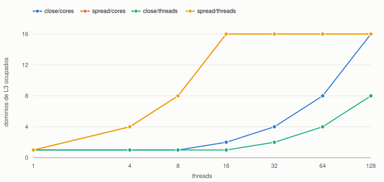
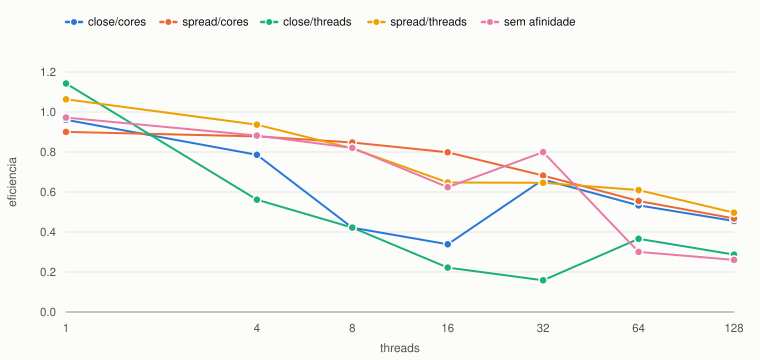
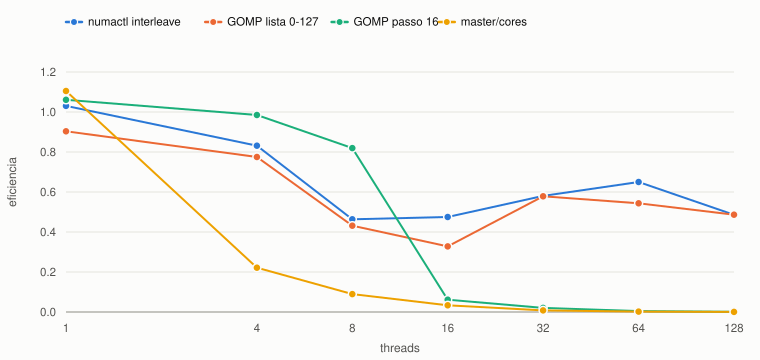

# Afinidade de threads e escalabilidade no NPAD

## O que foi medido

A Tarefa 12 mediu a escalabilidade do código de Navier-Stokes com a afinidade
**fixa** em `OMP_PROC_BIND=close` e `OMP_PLACES=cores`, e concluiu que o gargalo
dominante era capacidade de L3 agregado. Aqui essa variável deixa de ser fixa: o
código é o mesmo — a melhor versão da Tarefa 12, com região paralela única e
bordas distribuídas — e o que muda é só a política de afinidade.

**Máquina.** Mesmo nó da Tarefa 12: NPAD, partição `amd-512`, nó `r2n19` com
`--exclusive`. Dois AMD EPYC 7713, 64 núcleos cada, 2 threads por núcleo,
**8 domínios NUMA** de 16 núcleos e **32 MB de L3 por CCX de 8 núcleos** — 16 CCX,
512 MB de L3 somados. `n = 2048`, o que dá **128 MB** nas quatro matrizes.
gcc 8.5.0, `-O2 -Wall -Wextra -std=c11 -fopenmp`, mediana de 5 execuções,
200 passos.

Todas as configurações usam **o mesmo T(1) = 3,1714 s** (mediana de 9 execuções)
como base de speedup. Sem isso cada configuração se compararia com o próprio
sequencial e a eficiência não seria comparável entre elas.

O programa não supõe onde as threads foram parar: ele pergunta. Dentro de uma
região paralela cada thread chama `sched_getcpu()`, e o resultado é cruzado com
`/sys/devices/system/cpu/…/cache/index3/shared_cpu_list` e com o nó NUMA de cada
CPU. Assim cada linha de resultado traz quantos domínios de L3, nós NUMA e CPUs
distintas foram realmente ocupados.

## Os tipos de afinidade testados

**Do OpenMP** — `OMP_PROC_BIND` define a política e `OMP_PLACES` define o que é um
"lugar":

| configuração | o que faz |
|---|---|
| `false` | sem ligação; o sistema operacional move as threads à vontade |
| `master` | todas as threads no lugar da thread mestre |
| `close` | preenche lugares consecutivos a partir do lugar da mestre |
| `spread` | distribui as threads o mais longe possível umas das outras |
| `OMP_PLACES=threads` | lugar = uma thread de hardware (irmãs SMT contam separado) |
| `OMP_PLACES=cores` | lugar = um núcleo físico |
| `OMP_PLACES=sockets` | lugar = um socket inteiro; a ligação fica frouxa lá dentro |
| `OMP_PLACES=numa_domains` | **não suportado**: o gcc 8.5 implementa OpenMP 4.5, e esse nome abstrato é do OpenMP 5.0. O libgomp responde `Invalid value for environment variable OMP_PLACES` e passa a ignorar os lugares |

**Do sistema operacional:** `GOMP_CPU_AFFINITY` (extensão GNU, lista explícita de
CPUs), `numactl --interleave=all` (distribui as páginas em rodízio pelos nós NUMA)
e `numactl --cpunodebind=0 --membind=0` (confina CPU e memória a um nó).

## Onde as threads foram parar

Mapa `thread → cpu` com 8 threads, medido:

| configuração | CPUs ocupadas | domínios de L3 |
|---|---|---:|
| `close`/`cores` | 128, 1, 2, 3, 4, 5, 6, 7 | 1 |
| `close`/`threads` | 0, 128, 1, 129, 2, 130, 3, 131 | 1 |
| `spread`/`cores` | 128, 16, 32, 48, 64, 80, 96, 112 | 8 |
| `spread`/`threads` | 0, 16, 32, 48, 64, 80, 96, 112 | 8 |

Lembrando a topologia: o nó NUMA 0 são as CPUs 0–15, o nó 1 as 16–31, e assim por
diante. Então `spread` colocou **uma thread em cada nó NUMA**, enquanto `close`
empilhou as oito no nó 0. E `close`/`threads` é pior ainda: ocupou só **quatro
núcleos físicos**, com as duas irmãs SMT de cada um, porque para ele cada thread
de hardware é um lugar separado.

Domínios de L3 efetivamente ocupados. <code>spread</code> satura os 16 já com 16 threads; <code>close</code> leva até 128 threads para chegar lá.

## O efeito na escalabilidade

Eficiência contra a base comum. Em 1 thread os valores desviam de 1,0 por variação entre execuções, discutida adiante.

Tempos em segundos:

| threads | `false` | `master` | `close`/cores | `spread`/cores | `close`/threads | `spread`/threads |
|---:|---:|---:|---:|---:|---:|---:|
| 4 | 0,899 | 3,581 | 1,009 | 0,903 | 1,413 | 0,847 |
| 8 | 0,483 | 4,426 | 0,940 | **0,468** | 0,939 | 0,485 |
| 16 | 0,318 | 5,886 | 0,586 | **0,248** | 0,893 | 0,306 |
| 32 | 0,124 | 12,163 | 0,150 | 0,145 | 0,624 | 0,153 |
| 64 | 0,165 | 25,093 | 0,093 | 0,089 | 0,135 | 0,081 |
| 128 | 0,095 | 52,533 | 0,054 | 0,053 | 0,086 | **0,050** |

**`spread` elimina o platô que a Tarefa 12 encontrou.** Com `close`, a eficiência
desabava de 0,79 (4 threads) para 0,42 (8) e 0,34 (16). Com `spread` ela fica em
0,88, 0,85 e 0,80 na mesma faixa. Em tempo absoluto são **2,0× em 8 threads** e
**2,4× em 16**.

A razão é exatamente a que a Tarefa 12 apontou, e o gráfico de domínios de L3
mostra o mecanismo: o conjunto de trabalho é de 128 MB e cada CCX tem 32 MB. Com
`close` e 8 threads, todas cabem em um CCX e há 32 MB de cache para 128 MB de
dados. Com `spread`, as mesmas 8 threads ocupam 8 CCX, ou 256 MB, e o problema
passa a caber. **O platô nunca foi uma propriedade do código — era consequência da
afinidade que eu havia fixado.**

A partir de 32 threads as duas políticas convergem, porque aí `close` já ocupa
CCX suficientes por conta própria. Em 128 threads ambas ocupam os 16 e a
diferença desaparece.

**`master` é o contraexemplo.** Ele prende as 128 threads em 2 CPUs: o tempo vai
de 3,58 s com 4 threads para **52,5 s com 128**, ou seja, 16,6× mais lento que o
código sequencial. A eficiência chega a 0,0005. Serve para mostrar que afinidade
mal escolhida não degrada de leve — ela destrói o paralelismo.

**`OMP_PLACES=threads` prejudica com `close` e não com `spread`.** Com `close`, as
threads ocupam irmãs SMT do mesmo núcleo, que compartilham unidades de execução e
cache L1/L2: em 16 threads são 0,893 s contra 0,586 s de `close`/`cores`. Com
`spread`, as irmãs SMT ficam longe umas das outras e o resultado empata com
`spread`/`cores` — e é a melhor marca geral em 128 threads, 0,050 s.

**`false` e `sockets` são instáveis.** Sem ligação, o escalonador do sistema
espalha razoavelmente até 32 threads (eficiência 0,80, a melhor do experimento
nesse ponto), mas em 64 threads cai para 0,30 e o tempo piora em relação a 32.
`spread`/`sockets` chegou a 128 threads ocupando 127 CPUs distintas — duas threads
na mesma CPU. Ligação frouxa dá bons números às vezes e não dá garantia nenhuma.

`OMP_PLACES=numa_domains` foi recusado pelo libgomp e o processo seguiu sem
lugares definidos; os tempos resultantes acompanham `close`/`threads`, como
esperado de uma configuração que virou "sem lugares".

## Afinidade pelo sistema operacional

Configurações de sistema operacional, com <code>master</code>/<code>cores</code> incluída como referência do pior caso.

| threads | `numactl --interleave` | `GOMP` lista 0–127 | `GOMP` passo 16 | `numactl --cpunodebind=0` |
|---:|---:|---:|---:|---:|
| 4 | 0,953 | 1,023 | 0,805 | 1,038 |
| 8 | 0,855 | 0,918 | 0,484 | 0,937 |
| 16 | **0,417** | 0,604 | 3,225 | 0,598 |
| 32 | 0,171 | 0,171 | 4,863 | — |
| 64 | **0,076** | 0,091 | 11,343 | — |
| 128 | 0,051 | 0,051 | 24,351 | — |

**`numactl --interleave=all` melhora a ligação `close` sem tocar no código.** Em
16 threads, 0,417 s contra 0,586 s, 1,40× melhor; em 64 threads é o melhor tempo
de todo o experimento, 0,076 s. Espalhando as páginas em rodízio pelos nós NUMA,
ele resolve pelo lado do sistema operacional o mesmo problema que a Tarefa 12
resolveu pelo lado do código com *first touch* paralelo.

**`GOMP_CPU_AFFINITY` reproduz `close` quando a lista é completa e é um desastre
quando é curta.** Com `0-127` os tempos acompanham `close`/`cores` de perto. Com
`0-127:16` — passo 16, que parece "espalhar" — a lista tem apenas 8 CPUs
(0, 16, 32, …, 112). Até 8 threads ela é ótima, porque coloca uma por nó NUMA. A
partir de 16 threads a lista **dá a volta** e várias threads dividem a mesma CPU:
3,2 s com 16 threads, 24,4 s com 128. A coluna de CPUs distintas medida fica
travada em 8 e denuncia o problema. É uma armadilha silenciosa: nada avisa.

`numactl --cpunodebind=0 --membind=0` deu praticamente os mesmos tempos que
`close`/`cores` até 16 threads, o que era esperado, já que `close` preenche o nó 0
primeiro de qualquer forma.

## O que não dá para concluir

Os treze valores de T(1) medidos ao longo do experimento variam entre 2,49 s e
3,52 s, ou cerca de **±17%** em torno da mediana, mesmo cada um sendo mediana de 5
execuções e o nó estando reservado. É variação entre invocações do processo, não
dentro delas.

Por isso, diferenças menores que aproximadamente 20% entre duas configurações no
mesmo número de threads não sustentam conclusão. É o caso de `close` contra
`spread` com 4 threads (1,009 s contra 0,903 s, 12%) e de `spread`/`cores` contra
`spread`/`threads` em quase toda a faixa. Já os efeitos centrais — 2,0× e 2,4× de
`spread` sobre `close`, os 16,6× de degradação do `master`, os 24 s da lista GOMP
curta — estão muito acima do ruído.

Como controle de reprodutibilidade, a configuração `close`/`cores` deste
experimento e a versão `v4` da Tarefa 12, que são o mesmo código com a mesma
afinidade em jobs diferentes, deram 1,009 / 0,940 / 0,586 s e 1,061 / 0,956 /
0,623 s com 4, 8 e 16 threads: diferença de 5% a 6%.

## Conclusão

A escalabilidade deste código **muda mais com a afinidade do que mudou com as
quatro otimizações da Tarefa 12** na faixa de 4 a 16 threads. Trocar uma variável
de ambiente rendeu 2,4× onde reescrever o laço rendeu bem menos.

O motivo é específico e vale enunciar: o programa é limitado por memória, e a
política de afinidade decide quanto cache e quantos controladores de memória o
programa alcança. `spread` maximiza os dois desde poucas threads; `close` só
alcança o mesmo quando o número de threads já é grande o bastante para transbordar
os CCX por conta própria.

Daí a regra prática que este experimento sustenta: para código limitado por
memória e poucas threads, usar `spread`. Para código limitado por CPU que
compartilha dados entre threads vizinhas, `close` tende a ser melhor, porque
mantém as threads perto no cache. E `master` não serve para nada além de
demonstrar o pior caso.

Vale registrar que o melhor tempo absoluto em 64 threads não veio do OpenMP, e sim
do sistema operacional: `numactl --interleave=all` combinado com `close`. Em um
programa cujo gargalo é colocação de páginas, a ferramenta do sistema resolveu
melhor do que a política da biblioteca.

## Código

{{CODIGO:afinidade.c}}
