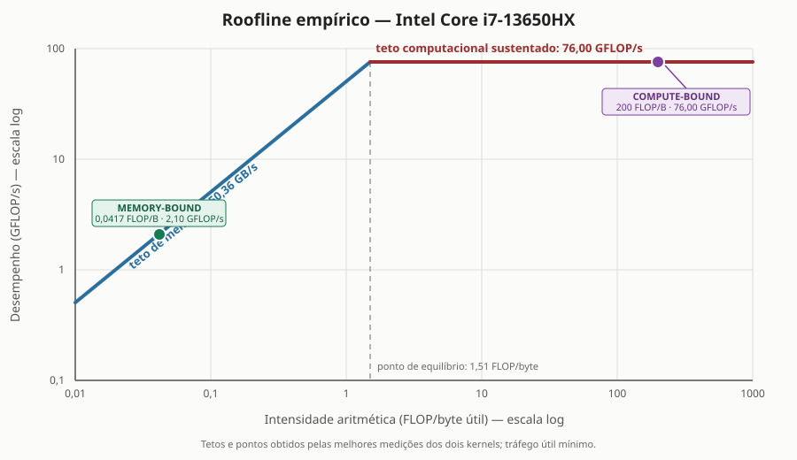

# Escalabilidade de programas limitados por memória e por CPU

## 1. Objetivo

O objetivo desta tarefa foi implementar e comparar dois programas paralelos em C
com OpenMP. O primeiro realiza somas simples em vetores grandes e foi projetado
para ser limitado pela movimentação de dados na memória. O segundo executa muitas
operações aritméticas sobre cada elemento e foi projetado para ser limitado pela
capacidade de cálculo da CPU.

Os dois programas foram medidos com diferentes números de threads para identificar
três regiões: quando acrescentar threads melhora o desempenho, quando o ganho se
estabiliza e quando a competição por recursos pode piorar o tempo. O Roofline
Model foi usado para relacionar a intensidade aritmética de cada programa aos
tetos sustentados de memória e de processamento.

## 2. Implementação

### 2.1 Programa limitado por memória

O núcleo do primeiro programa calcula, para vetores de `N` elementos:

<div class="formula">c[i] = a[i] + b[i]</div>

Cada iteração realiza apenas uma soma, mas precisa ler dois valores `double` e
gravar um terceiro. Portanto, são pelo menos 24 bytes transferidos para uma única
operação aritmética, ou aproximadamente 0,042 operação por byte. Essa baixa
intensidade aritmética faz a largura de banda da memória se tornar o principal
limite quando os vetores são maiores que a cache.

Foram usados `33.554.432` elementos por vetor. Os três vetores ocupam juntos 768
MiB, muito mais que os 24 MiB de cache compartilhada do processador testado. A
coluna de GB/s representa tráfego útil mínimo: duas leituras e uma escrita. O
tráfego físico pode ser maior por causa da política de escrita da cache.

### 2.2 Programa limitado por CPU

O segundo programa mantém quatro cadeias de recorrências aritméticas para cada
elemento. Em cada uma das 200 iterações internas há várias multiplicações e somas.
A carga completa realiza aproximadamente 3,2 bilhões de operações de ponto
flutuante, enquanto os vetores de entrada e saída ocupam somente 15,3 MiB.
Considerando 16 operações por iteração interna, uma leitura e uma escrita por
elemento, sua intensidade aritmética útil é:

<div class="formula">I<sub>CPU</sub> = (16 · 200) / 16 bytes = 200 FLOP/byte</div>

Assim, cada valor carregado é reutilizado muitas vezes em registradores antes de
um resultado ser escrito. A proporção entre cálculo e acesso à memória é muito
maior que no primeiro programa, deslocando o gargalo para as unidades de execução
da CPU.

### 2.3 Paralelização

Nos dois casos, as iterações do laço externo são independentes. A divisão do
trabalho foi feita diretamente com:

```c
#pragma omp parallel for schedule(static)
```

O escalonamento estático distribui blocos de iterações entre as threads e evita o
custo de redistribuir trabalho durante a execução. O ajuste dinâmico de threads do
OpenMP foi desativado com `omp_set_dynamic(0)`, e `omp_set_num_threads()` seleciona
a quantidade usada em cada medição.

## 3. Método de medição

Cada configuração foi aquecida uma vez e medida cinco vezes. O valor apresentado
é a mediana, menos sensível a interrupções ocasionais do sistema que a média. No
teste de memória, cada amostra contém quatro somas completas e seu tempo é dividido
por quatro. O teste de CPU foi executado três vezes; sua tabela apresenta a mediana
das três execuções completas, e cada uma delas já representa a mediana de cinco
amostras.

Foi medido tempo de parede com `QueryPerformanceCounter` no Windows e
`clock_gettime(CLOCK_MONOTONIC)` em sistemas POSIX. O código foi compilado com
`gcc -O2 -Wall -Wextra -std=c99 -fopenmp`. A variável de controle e a leitura de
amostras das saídas impedem que o compilador descarte os cálculos.

O computador de teste possui um Intel Core i7-13650HX, com 14 núcleos físicos
(6 P-cores e 8 E-cores) e 20 processadores lógicos, 32 GiB de RAM e Windows 11.
Não foi fixada afinidade: o posicionamento das threads foi decidido pelo
escalonador do Windows. Portanto, os resultados representam o desempenho geral do
programa nessa máquina, e não uma medição isolada de P-cores, E-cores ou SMT.

O *speedup* e a eficiência foram calculados por:

<div class="formula">S(p) = T(1) / T(p) &nbsp;&nbsp;&nbsp; e &nbsp;&nbsp;&nbsp; E(p) = S(p) / p</div>

## 4. Roofline Model

O Roofline Model limita o desempenho de um programa pelo menor entre o teto
computacional e o produto da largura de banda pela intensidade aritmética:

<div class="formula">P(I) = min(P<sub>máx</sub>, B<sub>máx</sub> · I)</div>

Foi construído um Roofline empírico com os melhores valores sustentados neste
experimento: `Bmáx = 50,36 GB/s` na soma de vetores e `Pmáx = 76,00 GFLOP/s` nas
recorrências. O ponto de equilíbrio entre os dois tetos é:

<div class="formula">I<sub>equilíbrio</sub> = 76,00 / 50,36 = 1,51 FLOP/byte</div>

| Programa | Intensidade | Desempenho observado | Limite do Roofline | Classificação |
|---|---:|---:|---:|---|
| Soma de vetores | 0,0417 FLOP/byte | 2,10 GFLOP/s | 2,10 GFLOP/s pela memória | *Memory-bound* |
| Recorrências | 200 FLOP/byte | 76,00 GFLOP/s | 76,00 GFLOP/s pela CPU | *Compute-bound* |

<div style="text-align:center; margin:3mm 0; page-break-inside:avoid">
  
</div>

A soma de vetores está muito à esquerda do ponto de equilíbrio. A reta de memória
prevê `50,36 × 0,0417 = 2,10 GFLOP/s`, exatamente a região observada. Acrescentar
capacidade aritmética não resolve esse gargalo; seria necessário mover os dados
mais rapidamente ou realizar mais trabalho com cada byte carregado.

As recorrências estão muito à direita do ponto de equilíbrio: a banda de memória
permitiria uma taxa muito superior ao teto computacional, de modo que são as
unidades de execução que limitam o programa. Os tetos foram obtidos dos próprios
kernels e representam desempenho sustentado, não o pico teórico de fábrica. Por
isso, este gráfico é uma descrição empírica e não uma medição independente do pico
absoluto da microarquitetura.

## 5. Resultados

### 5.1 Soma de vetores: *memory-bound*

| Threads | Tempo (s) | Speedup | Eficiência | GB/s úteis | GFLOP/s |
|---:|---:|---:|---:|---:|---:|
| 1 | 0,038428 | 1,000× | 100,0% | 20,96 | 0,873 |
| 2 | 0,027089 | 1,419× | 70,9% | 29,73 | 1,239 |
| 4 | 0,018967 | 2,026× | 50,6% | 42,46 | 1,769 |
| 6 | 0,018533 | 2,074× | 34,6% | 43,45 | 1,811 |
| 8 | 0,017474 | 2,199× | 27,5% | 46,08 | 1,920 |
| 10 | 0,017122 | 2,244× | 22,4% | 47,03 | 1,960 |
| 12 | 0,016805 | 2,287× | 19,1% | 47,92 | 1,997 |
| 14 | 0,016220 | 2,369× | 16,9% | 49,65 | 2,069 |
| 16 | 0,016240 | 2,366× | 14,8% | 49,59 | 2,066 |
| 20 | **0,015990** | **2,403×** | 12,0% | **50,36** | **2,099** |

O desempenho melhorou rapidamente de uma para quatro threads: a largura de banda
útil passou de 20,96 para 42,46 GB/s. A partir de quatro, o ganho marginal caiu
porque várias threads passaram a compartilhar os mesmos canais de memória. Entre
10 e 20 threads, a largura de banda permaneceu aproximadamente entre 47 e 50
GB/s, caracterizando estabilização. Houve uma pequena oscilação em 16 threads, mas
20 threads produziram o melhor tempo, somente 1,4% abaixo do tempo com 14.

### 5.2 Recorrências aritméticas: *compute-bound*

| Threads | Tempo (s) | Speedup | Eficiência | Giterações/s | GFLOP/s |
|---:|---:|---:|---:|---:|---:|
| 1 | 0,533217 | 1,000× | 100,0% | 0,38 | 6,00 |
| 2 | 0,274339 | 1,944× | 97,2% | 0,73 | 11,66 |
| 4 | 0,141456 | 3,769× | 94,2% | 1,41 | 22,62 |
| 6 | 0,099725 | 5,347× | 89,1% | 2,01 | 32,09 |
| 8 | 0,085463 | 6,239× | 78,0% | 2,34 | 37,44 |
| 10 | 0,072273 | 7,378× | 73,8% | 2,77 | 44,28 |
| 12 | 0,062852 | 8,484× | 70,7% | 3,18 | 50,91 |
| 14 | 0,055674 | 9,578× | 68,4% | 3,59 | 57,48 |
| 16 | 0,049861 | 10,694× | 66,8% | 4,01 | 64,18 |
| 20 | **0,042108** | **12,663×** | 63,3% | **4,75** | **76,00** |

O teste de CPU apresentou escalabilidade quase linear no começo: com quatro
threads chegou a 3,769×. O crescimento continuou com retornos decrescentes, mas
sem regressão na mediana consolidada. O melhor resultado ocorreu com 20 threads:
0,042108 s, *speedup* de 12,663× e 76,00 GFLOP/s.

## 6. Multithreading de hardware e os dois gargalos

O *hardware multithreading* permite que duas threads lógicas compartilhem um mesmo
núcleo físico. Ele não duplica as unidades de execução, a cache nem a largura de
banda. Seu efeito depende de quais recursos estavam ociosos.

No programa limitado por memória, uma thread frequentemente espera a chegada de
dados. Enquanto uma está parada por uma falta de cache, outra thread lógica pode
emitir instruções e manter mais requisições de memória em andamento. Isso pode
esconder parte da latência. Neste experimento, 20 threads foram 1,4% mais rápidas
que 14, mas o ganho foi pequeno porque a largura de banda total já estava próxima
do teto de 50 GB/s.

No programa limitado por CPU, threads lógicas que compartilham um núcleo também
compartilham unidades aritméticas, registradores, filas internas e cache. Se uma
thread já mantiver esses recursos ocupados, outra pode gerar competição e fazer o
ganho estabilizar ou até piorar. Por outro lado, dependências ou desvios podem
deixar ciclos ociosos que outra thread consegue aproveitar.

Neste experimento, o tempo do kernel de CPU continuou diminuindo até 20 threads.
Como não foi controlada a afinidade em uma CPU híbrida, não é possível atribuir
essa melhora especificamente ao multithreading de hardware. A conclusão correta é
apenas que a configuração completa OpenMP + Windows foi a mais rápida entre as
quantidades testadas. O efeito isolado de SMT dependeria de outro experimento, que
não é exigido nesta tarefa.

## 7. Conclusão

Adicionar threads ajudou ambos os programas no início, mas por motivos e até
limites diferentes. A soma de vetores atingiu rapidamente o teto compartilhado da
memória: depois de quatro threads, os ganhos foram pequenos e a taxa estabilizou
perto de 50 GB/s. A carga aritmética aproveitou mais threads por mais tempo e
chegou a um *speedup* de 12,663× com 20 threads no ambiente testado.

O Roofline Model tornou essa diferença explícita. A intensidade de 0,0417
FLOP/byte posicionou a soma de vetores sob o teto inclinado da memória, enquanto
200 FLOP/byte posicionaram as recorrências sob o teto horizontal de processamento.

O experimento mostra que a melhor quantidade de threads não deve ser escolhida
apenas pelo número de processadores lógicos. É necessário identificar o gargalo e
medir: uma thread de hardware adicional pode esconder espera de memória, mas pode
também disputar recursos que já estão ocupados em uma carga intensiva de CPU.

## 8. Referência

WILLIAMS, Samuel; WATERMAN, Andrew; PATTERSON, David. *Roofline: An Insightful
Visual Performance Model for Floating-Point Programs and Multicore Architectures*.
Technical Report UCB/EECS-2008-134, University of California, Berkeley, 2008.
[Publicação e PDF original](https://www2.eecs.berkeley.edu/Pubs/TechRpts/2008/EECS-2008-134.html).

<div class="quebra"></div>

## 9. Código-fonte: programa limitado por memória

{{CODIGO:memory_bound.c}}

<div class="quebra"></div>

## 10. Código-fonte: programa limitado por CPU

{{CODIGO:cpu_bound.c}}
